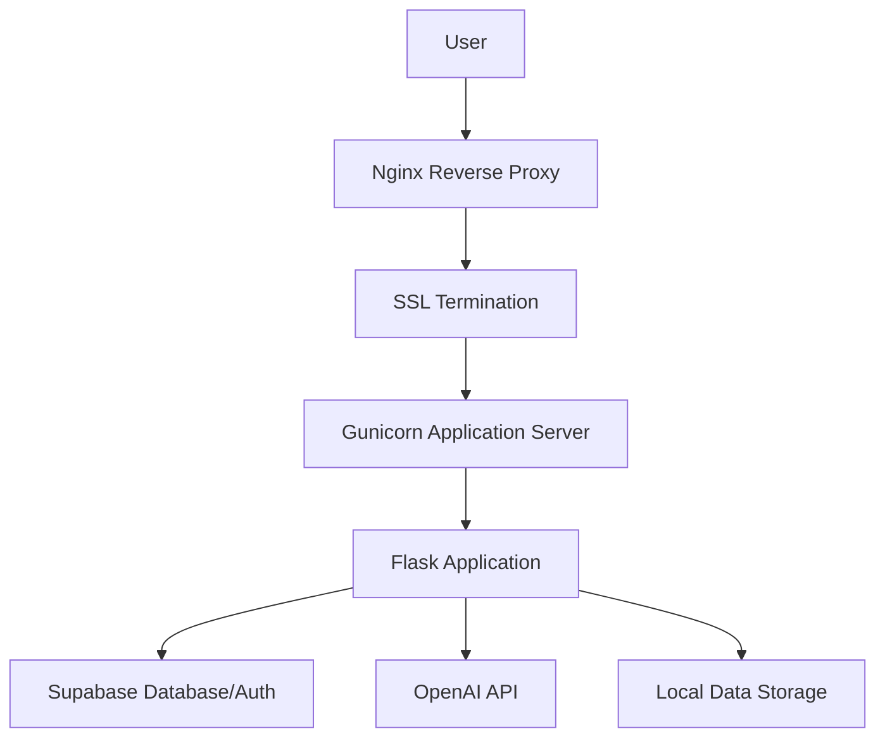

# SFDA Copilot Deployment Plan

## Overview

This document provides a comprehensive deployment plan for the SFDA Copilot application on your VPS server (168.231.77.203) using Ubuntu 22.04 LTS. The plan uses a simplified approach with Virtual Environment instead of Docker for faster deployment.

## Architecture Overview



## Key Decisions

- **Subdomain**: `sfda-copilot.aifoudahub.com`
- **Deployment Method**: Virtual Environment (simpler than Docker)
- **Port Strategy**: Different internal ports for multiple apps
- **SSL**: Let's Encrypt with Nginx reverse proxy
- **No monitoring/backups**: For simplicity

## Server Requirements

### System Requirements
- Ubuntu 22.04 LTS
- 2-4 CPU cores
- 4-8GB RAM
- 50-100GB storage
- Domain: `sfda-copilot.aifoudahub.com`

### Required Software
- Python 3.9
- Nginx
- Certbot (for SSL)
- Git

## Step-by-Step Deployment Plan

### Phase 1: Server Preparation

#### 1.1 Update System
```bash
sudo apt update && sudo apt upgrade -y
sudo apt install -y python3.9 python3-pip python3-venv nginx certbot python3-certbot-nginx git
```

#### 1.2 Create Directory Structure
```bash
sudo mkdir -p /var/www
sudo chown $USER:$USER /var/www
```

#### 1.3 Clone Repository
```bash
cd /var/www
git clone <your-repo-url> sfda-copilot
cd sfda-copilot
```

### Phase 2: Application Setup

#### 2.1 Create Virtual Environment
```bash
cd /var/www/sfda-copilot
python3 -m venv .venv
source .venv/bin/activate
```

#### 2.2 Install Dependencies
```bash
pip install -r requirements.txt
```

#### 2.3 Configure Environment
```bash
cp web/.env.example web/.env
# Edit web/.env with your actual values:
# OPENAI_API_KEY=your_openai_api_key
# SUPABASE_URL=your_supabase_url
# SUPABASE_ANON_KEY=your_supabase_anon_key
# FLASK_SECRET_KEY=your_secret_key
```

#### 2.4 Create Required Directories
```bash
mkdir -p data/regulatory data/pharmacovigilance processed_data logs
```

### Phase 3: Application Configuration

#### 3.1 Update Port Configuration
Since we're using virtual environment instead of Docker, we need to update the application to use a different port.

Edit `web/config.yaml`:
```yaml
server:
  port: 5001  # Changed from 5000 to avoid conflicts
```

#### 3.2 Test Application
```bash
cd web
source ../.venv/bin/activate
python api/app.py
```
Access at `http://localhost:5001` to test.

### Phase 4: Systemd Service Configuration

#### 4.1 Create Systemd Service
Create `/etc/systemd/system/sfda-copilot.service`:
```ini
[Unit]
Description=SFDA Copilot Service
After=network.target

[Service]
Type=simple
User=$USER
WorkingDirectory=/var/www/sfda-copilot
Environment=PATH=/var/www/sfda-copilot/.venv/bin
EnvironmentFile=/var/www/sfda-copilot/web/.env
ExecStart=/var/www/sfda-copilot/.venv/bin/gunicorn --bind 0.0.0.0:5001 --workers 2 --threads 2 "web.api.app:create_app()"
Restart=always
RestartSec=10

[Install]
WantedBy=multi-user.target
```

#### 4.2 Enable and Start Service
```bash
sudo systemctl daemon-reload
sudo systemctl enable sfda-copilot
sudo systemctl start sfda-copilot
sudo systemctl status sfda-copilot
```

### Phase 5: Nginx Configuration

#### 5.1 Create Nginx Site Configuration
Create `/etc/nginx/sites-available/sfda-copilot`:
```nginx
server {
    listen 80;
    server_name sfda-copilot.aifoudahub.com;
    return 301 https://$server_name$request_uri;
}

server {
    listen 443 ssl http2;
    server_name sfda-copilot.aifoudahub.com;
    
    ssl_certificate /etc/letsencrypt/live/sfda-copilot.aifoudahub.com/fullchain.pem;
    ssl_certificate_key /etc/letsencrypt/live/sfda-copilot.aifoudahub.com/privkey.pem;
    
    location / {
        proxy_pass http://localhost:5001;
        proxy_set_header Host $host;
        proxy_set_header X-Real-IP $remote_addr;
        proxy_set_header X-Forwarded-For $proxy_add_x_forwarded_for;
        proxy_set_header X-Forwarded-Proto $scheme;
    }
    
    access_log /var/log/nginx/sfda-copilot.access.log;
    error_log /var/log/nginx/sfda-copilot.error.log;
}
```

#### 5.2 Enable Site
```bash
sudo ln -s /etc/nginx/sites-available/sfda-copilot /etc/nginx/sites-enabled/
sudo nginx -t
sudo systemctl reload nginx
```

### Phase 6: SSL Certificate Setup

#### 6.1 Obtain SSL Certificate
```bash
sudo certbot --nginx -d sfda-copilot.aifoudahub.com
```

#### 6.2 Test Auto-Renewal
```bash
sudo certbot renew --dry-run
```

### Phase 7: GitHub Integration (Optional)

#### 7.1 Create GitHub Repository
If not already exists, create a GitHub repository for your project.

#### 7.2 Set up Deployment Script
Create `/var/www/sfda-copilot/deploy.sh`:
```bash
#!/bin/bash
cd /var/www/sfda-copilot
git pull origin main
source .venv/bin/activate
pip install -r requirements.txt
sudo systemctl restart sfda-copilot
```

Make executable:
```bash
chmod +x deploy.sh
```

#### 7.3 Set up GitHub Webhook (Optional)
Create a webhook in GitHub repository to trigger deployment on push.

## Port Management for Multiple Apps

### Port Assignment
| Application | Subdomain | External Port | Internal Port | Purpose |
|-------------|-----------|---------------|---------------|---------|
| SFDA Copilot | sfda-copilot.aifoudahub.com | 443 (HTTPS) | 5001 | Main application |
| Future App 1 | app1.aifoudahub.com | 443 (HTTPS) | 5002 | Future application |
| Future App 2 | app2.aifoudahub.com | 443 (HTTPS) | 5003 | Future application |

### Nginx Configuration for Multiple Apps
Each app will have its own Nginx configuration file in `/etc/nginx/sites-available/` with appropriate proxy_pass settings.

## Maintenance Commands

### Service Management
```bash
# Check service status
sudo systemctl status sfda-copilot

# Restart service
sudo systemctl restart sfda-copilot

# Stop service
sudo systemctl stop sfda-copilot

# View logs
sudo journalctl -u sfda-copilot -f
```

### Nginx Management
```bash
# Test Nginx configuration
sudo nginx -t

# Reload Nginx
sudo systemctl reload nginx

# View Nginx logs
sudo tail -f /var/log/nginx/sfda-copilot.access.log
sudo tail -f /var/log/nginx/sfda-copilot.error.log
```

### Application Management
```bash
# Activate virtual environment
cd /var/www/sfda-copilot
source .venv/bin/activate

# Run tests (if available)
python -m pytest

# Manual run for testing
cd web
python api/app.py
```

## Troubleshooting

### Common Issues

#### 1. Service Won't Start
```bash
# Check service status
sudo systemctl status sfda-copilot

# Check logs
sudo journalctl -u sfda-copilot --no-pager

# Check port availability
netstat -tlnp | grep 5001
```

#### 2. Nginx Configuration Issues
```bash
# Test configuration
sudo nginx -t

# Check syntax
sudo nginx -t -c /etc/nginx/sites-available/sfda-copilot
```

#### 3. SSL Certificate Issues
```bash
# Check certificate expiration
sudo certbot certificates

# Renew certificate
sudo certbot renew
```

#### 4. Application Issues
```bash
# Check application logs
tail -f /var/www/sfda-copilot/logs/app.log

# Test application directly
cd /var/www/sfda-copilot/web
source ../.venv/bin/activate
python api/app.py
```

## Security Considerations

### File Permissions
```bash
# Set proper permissions
sudo chown -R $USER:$USER /var/www/sfda-copilot
chmod 600 /var/www/sfda-copilot/web/.env
```

### Firewall Configuration
```bash
# Allow HTTP/HTTPS
sudo ufw allow 80/tcp
sudo ufw allow 443/tcp
sudo ufw enable
```

### Environment Variables
- Never commit `.env` file to version control
- Use strong, unique secrets for `FLASK_SECRET_KEY`
- Keep API keys secure and consider using environment variable management

## Deployment Checklist

- [ ] Server updated and software installed
- [ ] Directory structure created
- [ ] Repository cloned
- [ ] Virtual environment created and dependencies installed
- [ ] Environment variables configured
- [ ] Required directories created
- [ ] Port configuration updated
- [ ] Systemd service created and enabled
- [ ] Nginx configuration created
- [ ] SSL certificate obtained
- [ ] Service started and tested
- [ ] Application accessible via domain
- [ ] SSL working properly
- [ ] Logs configured and accessible

## Next Steps

1. **Execute the deployment plan** following the step-by-step instructions
2. **Test the application** thoroughly after each phase
3. **Configure DNS** for `sfda-copilot.aifoudahub.com` to point to your VPS
4. **Set up automated deployment** using the provided deploy script
5. **Document any customizations** made during deployment

This simplified deployment plan provides a fast and straightforward way to get your SFDA Copilot application running on your VPS without the complexity of Docker while maintaining clean separation for multiple applications.
