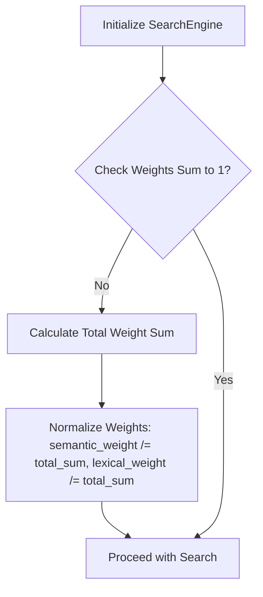
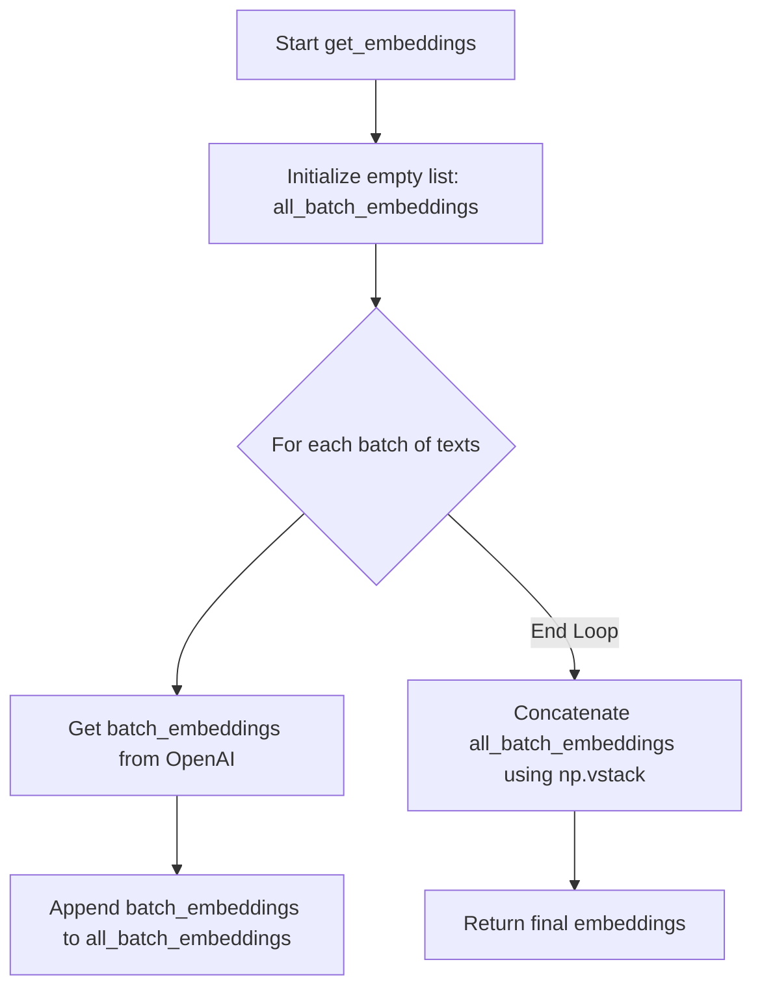

# Plan to Fix Logic Errors in SFDA Copilot

This document outlines a plan to address the identified logic errors and potential issues in the SFDA Copilot codebase. The "Invalid OpenAI Model Name" issue is excluded from this plan as per user instruction.

## 1. Configuration Mismatch - Chat History

**Problem**: The `web/api/app.py` file attempts to retrieve `chat_history_length` from the `server` section of `config.yaml`, but this key does not exist in the configuration. This leads to the default value being used, potentially overriding intended configuration.

**Location**: [`web/api/app.py:221`](web/api/app.py:221)

**Proposed Solution**:
Add `chat_history_length` to the `server` section in `web/config.yaml` to explicitly define the maximum number of chat message pairs. This ensures consistency and allows for easy configuration.

**Reasoning**: Explicitly defining configuration parameters in `config.yaml` improves readability, maintainability, and allows administrators to easily adjust settings without modifying code.

## 2. Configuration Mismatch - Rate Limiting

**Problem**: The `/api/chat` endpoint in `web/api/app.py` attempts to retrieve a specific rate limit for `chat_api` from the `rate_limit` section, but `chat_api` is not defined in `web/config.yaml`.

**Location**: [`web/api/app.py:324`](web/api/app.py:324)

**Proposed Solution**:
Add a `chat_api` key under the `server.rate_limit` section in `web/config.yaml` with an appropriate rate limit string (e.g., "10 per minute").

**Reasoning**: This ensures that the rate limiting for the chat API is properly configured and applied as intended, preventing potential abuse or overload.

## 3. Unsafe Type Conversions in Config Loader

**Problem**: In `web/utils/config_loader.py`, several configuration values are directly cast to `int` or `float` without error handling. If a non-numeric string is present in `config.yaml` or an environment variable, the application will crash.

**Location**: [`web/utils/config_loader.py:63-78`](web/utils/config_loader.py:63) (multiple lines)

**Proposed Solution**:
Implement robust error handling (e.g., using `try-except` blocks or `isdigit()` checks before conversion) for all type conversions in `ConfigLoader._apply_env_overrides`. If conversion fails, log a warning and fall back to a sensible default or raise a more informative error.

**Reasoning**: This makes the configuration loading more resilient to malformed input, preventing application crashes and providing clearer debugging information.

## 4. Flask Context Issue in Supabase Client

**Problem**: The `current_app` object, which is part of Flask's application context, is accessed directly during the `SupabaseClient` singleton initialization. This can lead to issues if `SupabaseClient()` is called outside of an active Flask application context (e.g., during script startup or in a background thread not properly configured).

**Location**: [`web/utils/supabase_client.py:17`](web/utils/supabase_client.py:17)

**Proposed Solution**:
Refactor `SupabaseClient` to ensure `current_app` is only accessed when an application context is guaranteed to be active. This might involve passing the app instance explicitly or using Flask's `app_context` or `request_context` where appropriate. For testing, consider injecting a mock `current_app` more explicitly.

**Reasoning**: Ensures the Supabase client initialization is robust and doesn't fail in environments where Flask's `current_app` might not be available.

## 5. Inconsistent Array Shapes in OpenAI Client

**Problem**: The `get_embedding` method in `web/utils/openai_client.py` returns a NumPy array with shape `(1, -1)` (a 2D array), but the `_semantic_search` method in `web/services/search_engine.py` expects a 1D array for cosine similarity calculations or might handle it differently depending on the exact FAISS index type. While FAISS `search` method expects 2D, the subsequent processing might assume 1D.

**Location**: [`web/utils/openai_client.py:70`](web/utils/openai_client.py:70)

**Proposed Solution**:
Ensure consistency in array shapes. If `_semantic_search` expects a 1D array for internal processing (e.g., for `cosine_similarity` if it were used directly on the query embedding), then `get_embedding` should return a 1D array, or `_semantic_search` should explicitly reshape it. Given that FAISS `search` expects 2D, the current `reshape(1, -1)` might be correct for FAISS, but the comment in `search_engine.py` about `query_embedding_faiss` expecting 2D suggests this is already handled. The main concern is if `get_embedding` is used elsewhere expecting 1D. Clarify and ensure consistent usage.

**Reasoning**: Prevents potential dimension mismatch errors in numerical operations, ensuring correct behavior of the search engine.

## 6. Logging Before Configuration

**Problem**: The `logging.info("Loaded .env from %s", DOTENV_PATH)` call in `web/api/app.py` occurs before the `logging.basicConfig` is called. This means the initial log message might not adhere to the configured format or level.

**Location**: [`web/api/app.py:46`](web/api/app.py:46)

**Proposed Solution**:
Move the `logging.info("Loaded .env from %s", DOTENV_PATH)` line to after the `logging.basicConfig` call (lines 55-57) in `web/api/app.py`.

**Reasoning**: Ensures all log messages, including early ones, follow the defined logging configuration, making debugging more consistent.

## 7. Incomplete Weight Normalization

**Problem**: In `web/services/search_engine.py`, the `semantic_weight` and `lexical_weight` are checked if they sum to 1.0, and a warning is logged if they don't. However, no normalization is performed, which means the hybrid score calculation might be skewed if the weights are not properly set.

**Location**: [`web/services/search_engine.py:105-107`](web/services/search_engine.py:105)

**Proposed Solution**:
Implement a normalization step for `semantic_weight` and `lexical_weight` within the `__init__` method of `ImprovedSearchEngine`. If their sum is not 1.0, divide each by their sum to ensure they add up to 1.0.

**Reasoning**: Ensures that the hybrid search score is always a true weighted average, preventing unintended bias towards either semantic or lexical results due to incorrect weight configuration.

## 8. Confusing Error Condition in Semantic Search

**Problem**: In `web/services/search_engine.py`, the condition `if idx != -1:` for logging invalid FAISS indices is backwards. FAISS returns `-1` for indices that are not found or out of bounds. The current logic would warn for valid indices if `idx` is not `-1`, and silently ignore the actual invalid `-1` indices.

**Location**: [`web/services/search_engine.py:376-377`](web/services/search_engine.py:376)

**Proposed Solution**:
Change the condition to `if idx == -1:` to correctly identify and log invalid indices returned by FAISS.

**Reasoning**: Correctly identifies and logs actual issues with FAISS search results, improving debugging and robustness.

## 9. Inefficient Array Operations in OpenAI Client

**Problem**: The `get_embeddings` method in `web/utils/openai_client.py` initializes an empty NumPy array and then repeatedly uses `np.vstack` in a loop to append batch embeddings. This is inefficient as it involves creating new arrays and copying data in each iteration.

**Location**: [`web/utils/openai_client.py:34-50`](web/utils/openai_client.py:34)

**Proposed Solution**:
Collect all batch embeddings into a Python list first, and then use `np.vstack` once after the loop to combine them into a single NumPy array. Alternatively, pre-allocate the `embeddings` array if the total number of embeddings is known beforehand.

**Reasoning**: Improves performance by reducing the number of array reallocations and data copying operations, especially for large numbers of texts.

## 10. Fragile Error Response Handling in Auth

**Problem**: In `web/api/auth.py`, the code assumes that `response.error` will always be an object with a `message` attribute if an error occurs. Different versions of the Supabase client or different error types might structure the error response differently, leading to `AttributeError` or `KeyError`.

**Location**: [`web/api/auth.py:24`](web/api/auth.py:24), [`web/api/auth.py:59`](web/api/auth.py:59)

**Proposed Solution**:
Implement more robust error handling by checking the type of `response.error` and safely accessing its attributes. Consider using `getattr` with a default value or checking if `response.error` is `None` before attempting to access `response.error.message`.

**Reasoning**: Makes the authentication error handling more resilient to variations in Supabase client responses, preventing crashes and providing more consistent error messages to the user.

## 11. Complex Page Number Parsing in Search Engine

**Problem**: The page number parsing logic in `web/services/search_engine.py` is overly complex and might not correctly handle all valid integer or float page numbers (e.g., negative numbers, or floats that are actually integers like `1.0`) due to the `isdigit()` check.

**Location**: [`web/services/search_engine.py:598-601`](web/services/search_engine.py:598)

**Proposed Solution**:
Simplify the page number parsing. If `chunk_data['page']` is expected to be numeric, directly attempt to convert it to `int` after checking for `pd.notna`. Handle `ValueError` for non-numeric cases.

**Reasoning**: Simplifies the code, makes it more readable, and ensures correct parsing of page numbers while still handling missing or invalid data gracefully.
